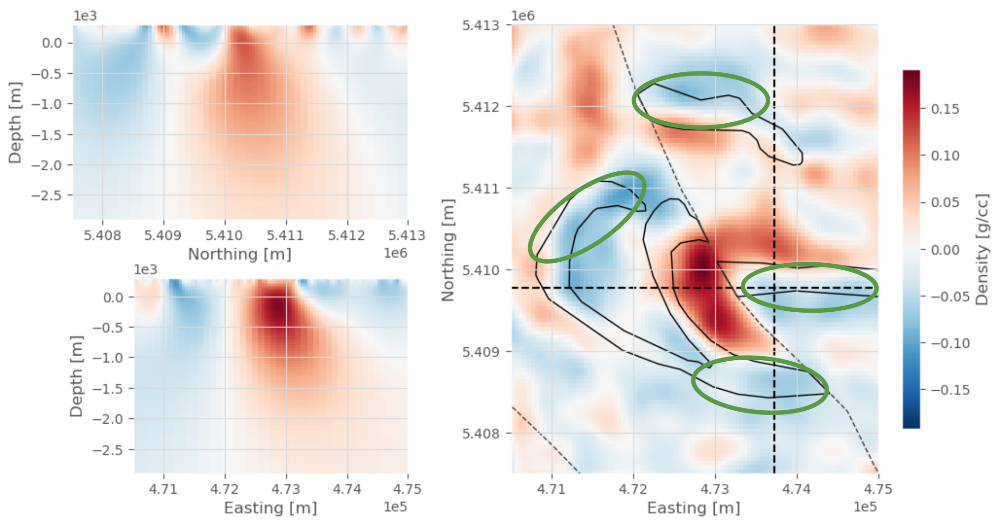

<!-- .slide: class="center slide-title" -->

<h1 class="title">
Applying geophysical inversions to carbon mineralization
</h1>

<h2 class="authors">
Santiago Soler
</h2>

<h3 class="affiliation">
Geophysical Inversion Facility (GIF) - UBC
</h3>

---

## Geophysics

<!-- - Gravity field -->
<!-- - Magnetic field -->
<!-- - Electromagnetic fields -->
<!-- - Mechanical waves propagation -->

  

    
Gravity field

    
  

  

    
Magnetic field

    
  

  

    
Electromagnetic fields

    
  

  

    
Wave propagation

    
  

---

<!-- .slide: class="center" -->

### Geophysics: all about physical properties

- Density
- Magnetic susceptibility
- Conductivity
- Wave velocity

---

## Physical properties affect fields

---

## What's in the subsurface?

---

### Gravity disturbances

<!-- Global bouguer map -->

---

### Magnetic anomalies

---

<!-- .slide: class="center slide-title" data-auto-animate -->

### Mid ocean ridges

Gravity disturbances

Magnetic anomalies

---

<!-- .slide: class="center slide-title" data-auto-animate -->

### Mid ocean ridges

Magnetic anomalies

---

### Forward problem

Given a **model** ($\mathbf{m}$) of the subsurface, we can  
_forward model_ the gravity or magnetic fields (**data** $\mathbf{d}$):

`$$ \mathbf{d} = f(\mathbf{m}) $$`

---

<!-- .slide: class="center" -->

### Inverse problem

Given some **data** ($\mathbf{d}$),
  can we get a **model** of the subsurface?

---

---

## Inverse problem

$$
  \operatorname*{min}\limits_{\mathbf{m}} \phi(\mathbf{m}) =
  \textcolor{#a6da95}{\phi_d}(\mathbf{m}) +
  \beta \textcolor{#ee99a0}{\phi_m}(\mathbf{m})
$$
$$
  \text{s.t.}
  \quad
  \phi_d \le \phi_d^*
  \quad
  ,
  \quad
  \mathbf{m}_L \le \mathbf{m} \le \mathbf{m}_U
$$

Data misfit:

$$
  \phi_d(\mathbf{m}) =
  \lVert \mathbf{W}_d \left( \mathbf{d} - f(\mathbf{m}) \right) \rVert^2
$$

Regularization term:

$$
  \phi_m(\mathbf{m})
$$

---

<!-- .slide: class="center" -->

## Carbon mineralization

---

<!-- .slide: class="center" -->

### Alterations

Mitchinson et al. (2020)

---

<!-- .slide: class="center" data-auto-animate -->

### Physical properties of ultramafic rocks

**Loss of Ignition** (LOI):

- Proxy variable for alteration
- 5%-13%: **high** carbonation potential
- **Density** and **susceptibility** change with LOI

Serpentinized rocks with **good potential**:

- **Low** density
- ~**High** susceptibility

Cutts et al. (2021).
doi: [10.1029/2021GC009989](https://doi.org/10.1029/2021GC009989)

---

<!-- .slide: class="center" data-auto-animate -->

### Physical properties of ultramafic rocks

Cutts et al. (2021).
doi: [10.1029/2021GC009989](https://doi.org/10.1029/2021GC009989)

---

### Real world data: Timmins, ON

Airborne gravity gradiometry and magnetic data <!-- .element: class="font-s" -->

---

### Inversion of magnetic data

---

### Inversion of gravity data

---

### Inversion of gravity data

---

### Cross plot of physical properties

---

### Estimations of carbonation potential

---

### Estimations of carbonation potential

<iframe src="figs/3d-plot-l2-distance.html" frameborder="0" style="height: 100%; width: 100%;"></iframe>

---

<!-- .slide: class="center" data-visibility="hidden" -->

<h2> Is this model <em class="green">the truth</em>? </h2>

### Not necessarily! <!-- .element: class="fragment" -->

 

<ul>
  <li class="fragment">
    Inversions are <strong class="orange">ill-posed problems</strong>:
  <ul>
    <li class="fragment"> Non-unique solution </li>
    <li class="fragment"> Small changes in the model can lead to large changes in the data </li>
  </ul>
  </li>
</ul>

---

<!-- .slide: class="center" -->

<h2> Is this model <em class="green">the truth</em>? </h2>

### Not necessarily! <!-- .element: class="fragment" -->

 

  Inversions are <strong class="orange">ill-posed problems</strong>:
   
  Non-unique solution

---

<!-- .slide: class="center" -->

### Changing the regularization term

$$
  \operatorname*{min}\limits_{\mathbf{m}} \phi(\mathbf{m}) =
  \textcolor{#a6da95}{\phi_d}(\mathbf{m}) +
  \beta
  \underbrace{
    \textcolor{#ee99a0}{\phi_m}(\mathbf{m})
  }_{\mathclap{\text{\textcolor{#ee99a0}{regularization term}}}}
$$

L2 norm:

$$
{\phi_m^2}(\mathbf{m}) =
\lVert
\mathbf{W}_s (\mathbf{m} - \mathbf{m}_\text{ref})
\rVert^{\textcolor{#c44500}{2}}
$$

Sparse (Lp) norm:

$$
{\phi_m^2}(\mathbf{m}) =
\lVert
\mathbf{W}_s (\mathbf{m} - \mathbf{m}_\text{ref})
\rVert^{\textcolor{#c44500}{p}}
,\quad
p \in [0, 2)
$$

---

<!-- .slide: class="center" -->

L2 inversion result

Sparse inversion result

---

### Petrophysically Guided Inversion (PGI)

Including petrophysical data in the inversion

 <!-- unclassed div -->

 <!-- r-stretch -->

Astic et al. (2019, 2020):
[10.1093/gji/ggz389](https://doi.org/10.1093/gji/ggz389)
and
[10.1093/gji/ggaa378](https://doi.org/10.1093/gji/ggaa378)

---

<!-- .slide: class="center slide-conclusions" -->

## Conclusions

- **Geophysical inversions** allow us to **estimate CO2 sequestration potential** of serpentinized rocks
- Not a silver bullet: different inversion results provide different knowledge.
- **Geologic interpretation** of the inversion results is crucial to better
  understand the subsurface.

---

<!-- .slide: class="center" -->

## Open-source software

---

<!-- .slide: class="center" -->

# Thank you!

