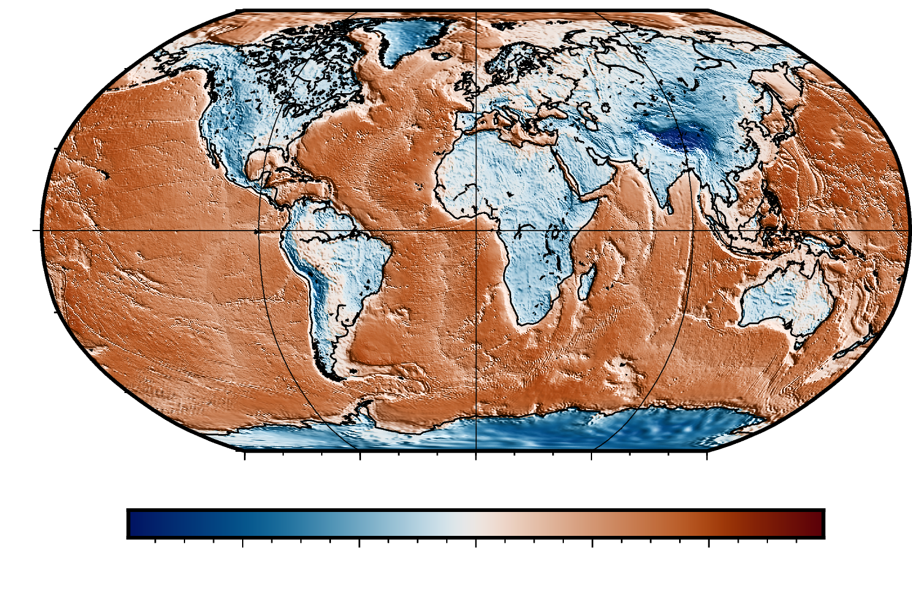

<!-- .slide: class="center slide-title" -->

<h1 class="title">
Applying geophysical inversions to carbon mineralization
</h1>

<h2 class="authors">
Santiago Soler
</h2>

<h3 class="affiliation">
Geophysical Inversion Facility (GIF) - UBC
</h3>

<div class="logos">


</div>

---

## Geophysics

<!-- - Gravity field -->
<!-- - Magnetic field -->
<!-- - Electromagnetic fields -->
<!-- - Mechanical waves propagation -->

<div class="d-flex flex-row">
  <div class="flex-1">
    <p class="font-s mb-0">Gravity field</p>
    
  </div>
  <div class="flex-1">
    <p class="font-s mb-0">Magnetic field</p>
    
  </div>
</div>

<div class="d-flex flex-row">
  <div class="flex-1">
    <p class="font-s mb-0">Electromagnetic fields</p>
    
  </div>
  <div class="flex-1">
    <p class="font-s mb-0">Wave propagation</p>
    
  </div>
</div>

---

### Geophysics: all about physical properties

<div class="r-stretch centered">

- Density
- Magnetic susceptibility
- Conductivity
- Wave velocity

</div>

---

## Physical properties affect fields

<div class="d-flex flex-row">
<div class="flex-1">

</div>
<div class="flex-1">

</div>
</div>


---


## What's in the subsurface?

<div class="r-stretch">
<div class="centered">

</div>
</div>

---

### Gravity disturbances

<!-- Global bouguer map -->

<div class="r-stretch">

</div>


---

### Magnetic anomalies

<div class="r-stretch">

</div>

---


### Mid ocean ridges

<div class="r-stretch">
<div class="centered">

<div>
<p>Gravity disturbances</p>

</div>

<div>
<p>Magnetic anomalies</p>

</div>

</div>
</div>

---

### Forward problem

Given a **model** ($\mathbf{m}$) of the subsurface, we can <br>
_forward model_ the gravity or magnetic fields (**data** $\mathbf{d}$):

<div class="d-flex flex-row">

<div class="flex-1 d-flex flex-column justify-center">

`$$ \mathbf{d} = f(\mathbf{m}) $$`

</div>

<div class="flex-1">


</div>

</div>

---

### Inverse problem

Given some **data** ($\mathbf{d}$), can we get a **model** of the subsurface?

<div class="r-stretch">

</div>

---

<div class="r-stretch">

<div class="centered">


</div>
</div>

---

## Inverse problem

$$
  \operatorname*{min}\limits_{\mathbf{m}} \phi(\mathbf{m}) =
  \textcolor{#a6da95}{\phi_d}(\mathbf{m}) +
  \beta \textcolor{#ee99a0}{\phi_m}(\mathbf{m})
$$
$$
  \text{s.t.}
  \quad
  \phi_d \le \phi_d^*
  \quad
  ,
  \quad
  \mathbf{m}_L \le \mathbf{m} \le \mathbf{m}_U
$$


<div class="d-flex flex-row justify-center align-center gap-3 font-s">

<p style="color: #a6da95;">Data misfit:</p>

$$
  \phi_d(\mathbf{m}) =
  \lVert \mathbf{W}_d \left( \mathbf{d} - f(\mathbf{m}) \right) \rVert^2
$$

</div>

<div class="d-flex flex-row justify-center align-center gap-3 font-s">

<p style="color: #ee99a0;">Regularization term:</p>

$$
  \phi_m(\mathbf{m})
$$

</div>

---

<!-- .slide: class="center" -->

## Carbon mineralization

---

<!-- .slide: class="center data-auto-animate" -->

### Physical properties of ultramafic rocks

<div class="d-flex flex-row justify-around align-center gap-1">

<div class="flex-1">

</div>

<div class="d-flex flex-column align-start font-s">

**Loss of Ignition** (LOI):

- Proxy variable for alteration
- 5%-13%: **high** carbonation potential
- **Density** and **susceptibility** change with LOI

<p></p>

Serpentinized rocks with **good potential**:

- **Low** density
- ~**High** susceptibility

</div>

</div>

---

<!-- .slide: class="center" data-auto-animate -->

### Physical properties of ultramafic rocks

<div class="d-flex flex-row justify-around align-center gap-1">

<div class="flex-1">

</div>

<div class="flex-1">

</div>

</div>

---

### Real world data: Timmins, ON

Airborne gradiometry and magnetic data <!-- .element: class="font-s" -->

<div class="r-stretch">

<div class="d-flex centered flex-row justify-center">

<div class="flex-2">

</div>
<div class="flex-1">

</div>

</div>

</div>

<div class="d-flex justify-end flex-row">

</div>

---

### Inversion of magnetic data

<div class="r-stretch">
<div class="centered">

</div>
</div>

---

### Inversion of gravity data

<div class="r-stretch">
<div class="centered">

</div>
</div>

---

### Inversion of gravity data

<div class="r-stretch">
<div class="centered">

</div>
</div>

---

### Cross plot of physical properties

<div class="r-stretch">
<div class="centered">

</div>
</div>

---

### Estimations of carbonation potential

<div class="r-stretch">
<div class="centered">

</div>
</div>

---

### Estimations of carbonation potential

<div class="d-flex justify-center" style="height: 100vh">
<iframe src="figs/3d-plot-l2-distance.html" frameborder="0" style="height: 100%; width: 100%;"></iframe>
</div>

---

# My slides

---

<!-- .slide: class="center" -->

## This is another slide

<div class="centered r-stretch">

- with
- items

</div>

---

1. enumerate
2. lists

---

<!-- .slide: class="center" -->

# Code

```python
import harmonica as hm

hm.prism_gravity(coordinates, prisms, density, field="g_z")
```
